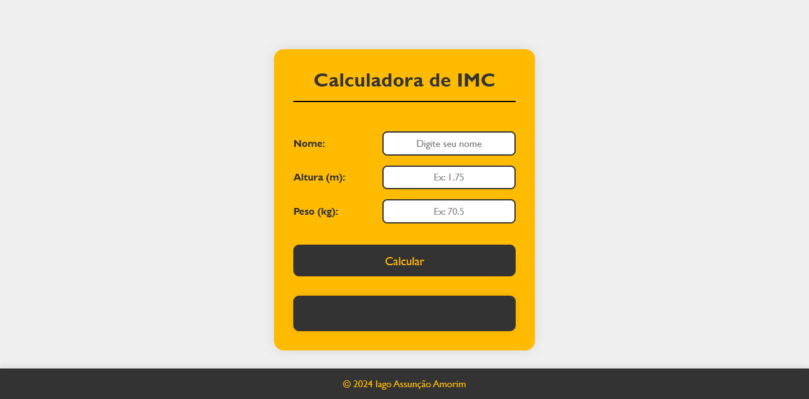
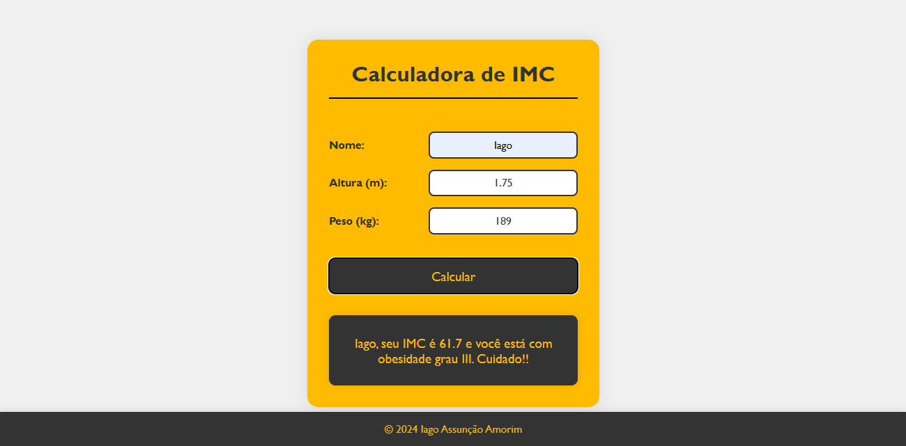

# Calculadora de IMC

Este é um projeto simples de uma calculadora de Índice de Massa Corporal (IMC) desenvolvida utilizando HTML, CSS e JavaScript. O objetivo é permitir que os usuários insiram suas informações de nome, altura e peso, e obtenham o cálculo do IMC com uma classificação correspondente ao resultado.

## Funcionalidades

- **Cálculo do IMC:** A calculadora permite que o usuário insira seu nome, altura (em metros) e peso (em quilogramas) e calcule o IMC.
- **Classificação do IMC:** Com base no valor calculado do IMC, o usuário recebe uma classificação de acordo com as categorias de IMC (abaixo do peso, peso ideal, sobrepeso, obesidade, etc.).
- **Design Responsivo:** O layout é otimizado para diferentes tamanhos de tela, garantindo uma boa experiência em dispositivos móveis, tablets e desktops.

## Imagens do Projeto

### Tela Principal



### Exemplo de Resultado



*Substitua "path/to/image.png" pelo caminho real do arquivo de imagem.*

## Pré-requisitos

Nenhum software adicional é necessário para rodar o projeto, além de um navegador web moderno. Basta clonar ou baixar os arquivos e abrir o arquivo `index.html` em seu navegador.

## Estrutura do Projeto

O projeto contém os seguintes arquivos principais:

- **index.html:** O arquivo HTML que estrutura a página.
- **style.css:** O arquivo CSS que define o estilo e layout da página.
- **codigo.js:** O arquivo JavaScript que contém a lógica para calcular o IMC e exibir o resultado.

## Como Usar

1. Clone o repositório para o seu computador:

   ```bash
   git clone https://github.com/Iago-Amorim/calculadora-imc.git
   ```

2. Navegue até o diretório do projeto:

   ```bash
   cd calculadora-imc
   ```

3. Abra o arquivo `index.html` no seu navegador de internet preferido.

4. Insira seu nome, altura (em metros) e peso (em quilogramas) nos campos apropriados e clique no botão "Calcular" para ver o resultado do seu IMC e sua classificação.

## Exemplo de Uso

Digite seu nome, altura e peso, e clique em "Calcular":

- Nome: João
- Altura: 1.75
- Peso: 70.5

O resultado exibido será algo como:

```plaintext
João, seu IMC é 23.0 e você está com peso ideal. Parabéns!!!
```

## Personalização

Você pode personalizar o projeto modificando o arquivo `style.css` para alterar as cores, fontes e layout da página. Se desejar, também pode expandir as funcionalidades do JavaScript em `codigo.js`.

## Licença

Este projeto é de código aberto e está licenciado sob a [MIT License](LICENSE).